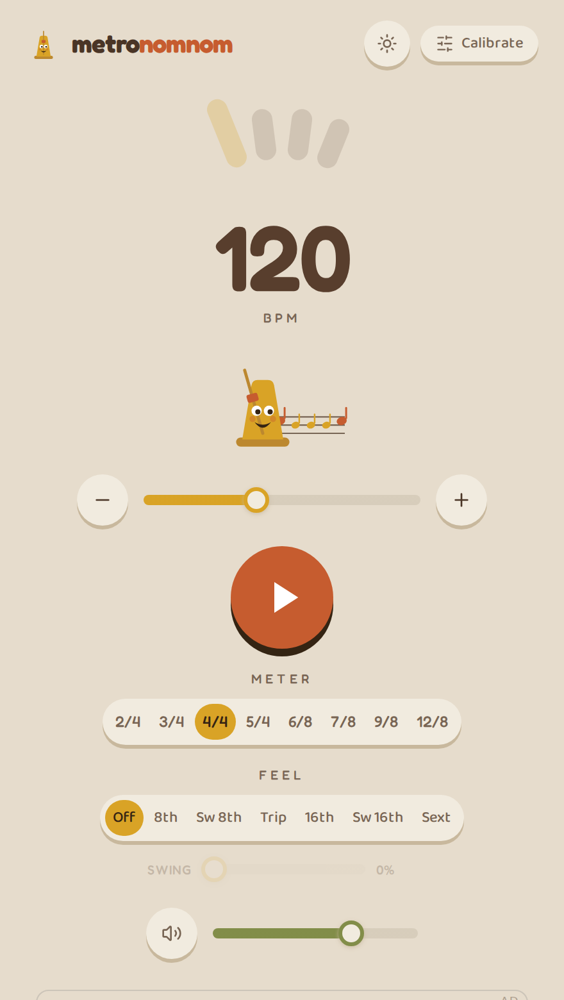
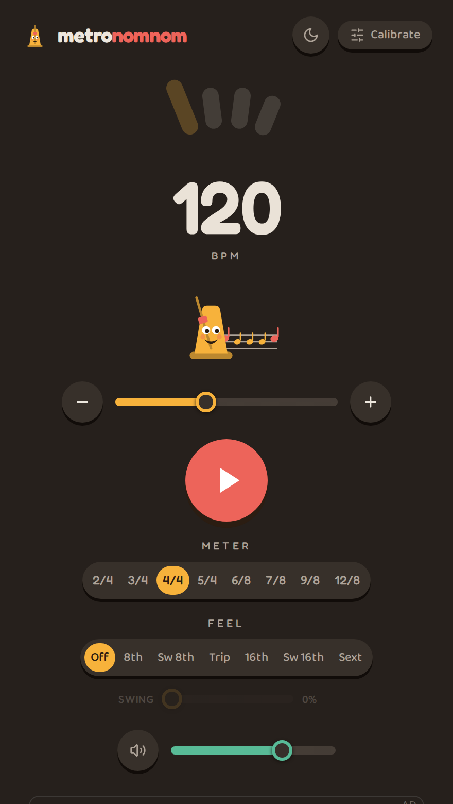

# metronomnom

### A free online metronome that actually lands on the beat.

[**metronomnom.com**](https://metronomnom.com) — no install, no sign-up, runs right in your browser.

<table>
<tr>
<td></td>
<td></td>
</tr>
</table>

---

metronomnom is a tiny, fast, single-screen metronome — with a wind-up-metronome mascot that
chomps notes in time with the beat. Set a tempo, pick a meter, dial in a feel, and play. And
unlike most browser metronomes, it **compensates for your device's audio latency**, so every
click actually lands when it should.

## Why it's different

Most web metronomes drift. Your browser and your speakers/headphones add output latency, so the
click you *hear* is a little late — fine for casual use, maddening for tight practice.
metronomnom measures that delay and corrects for it automatically, and lets you fine-tune it for
your exact setup with a quick **tap-in calibration**. Being on time is the whole point.

## What you get

- **Tempo** 40–240 BPM — a big readout, a slider, and fine ± steppers.
- **Time signatures** — 2/4, 3/4, 4/4, 5/4, 6/8, 7/8, 9/8, 12/8, with downbeat accents.
- **Feel & swing** — straight or swung 8ths/16ths, triplets, sextuplets; a swing slider for the groove.
- **Latency calibration** — automatic compensation, plus a manual tap-in for your headphones or speakers.
- **Mute** — keep the visual beat without the click.
- **Two playful themes** — light (Retro 70s) and dark (Warm Dark) — one tap to switch.
- **The mascot** — a little metronome that eats notes drawn at *your* current feel (quarters, eighths,
  sixteenths…), perfectly in sync with the beat.
- **Fast & mobile-first** — loads instantly, works in any modern browser, no app to install.

## Tech notes

A lean **React 19 + Vite 8 (Rolldown) + Tailwind** single-page app. A few things worth knowing:

- **The hard part lives in a library.** The audio engine, timing, design tokens, and calibration
  primitives are in [`@fretwork/lib`](https://github.com/jrgtwo/fretwork-lib) (Tone.js under the
  hood); this repo is mostly composition + layout.
- **Latency-honest by design.** The engine applies `browser outputLatency + a saved per-device
  offset`. A platform seam (`nativeLatency`) is ready for a future native shell to report the OS
  audio latency directly.
- **Animation is phase-locked to the audio clock.** The mascot's pendulum, body, and note conveyor
  are driven by the engine's beat clock and run on a steady pulse — like a real metronome — so the
  visuals stay in lockstep with the click.
- **Instant first paint.** It's client-rendered, so the build injects a gray *paint-shell* that's
  auto-generated from the real app — the page paints immediately instead of waiting on the JS bundle.
- **Type-checked & linted.** TypeScript 6 (strict) + ESLint 9 (type-checked), gated on commit.

## Running it yourself

Setup, the git-dependency workflow, scripts, and deployment all live in
**[DEVELOPMENT.md](./DEVELOPMENT.md)**.

---

Free and ad-supported. Built with an unreasonable amount of attention to timing.
